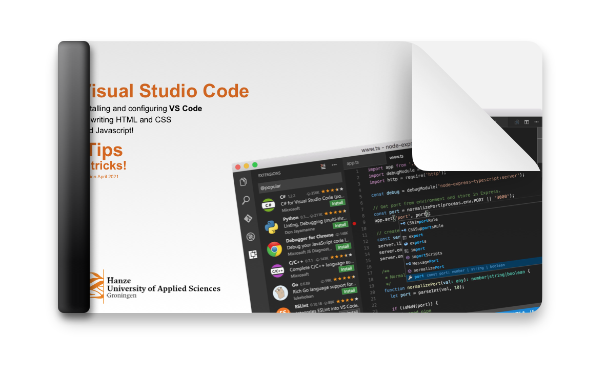

# VS Code editor tips!

PDF met tips en truuks om VS Code zodanig in te richten en te configureren zodat je razendsnel kan coderen!
- bevat tips over hoe je het snelst kan coderen
- de belangrijkste shortcuts uitgelegd
- enkele instellingen die je alvast in de settings kan doen om te starten
- hoe je het preview venster inricht om automatisch een preview van je HTML pagina te zien
- tips voor de belangrijkste extensies/plugins
- bonus gedeelte met tips voor JavaScript

## Download de PDF hier:

[VSCode HTML en CSS editor tips NL.pdf](https://github.com/CMD-Groningen/vs-code-editor-tips/blob/main/VSCode%20HTML%20en%20CSS%20editor%20tips%20NL.pdf)

